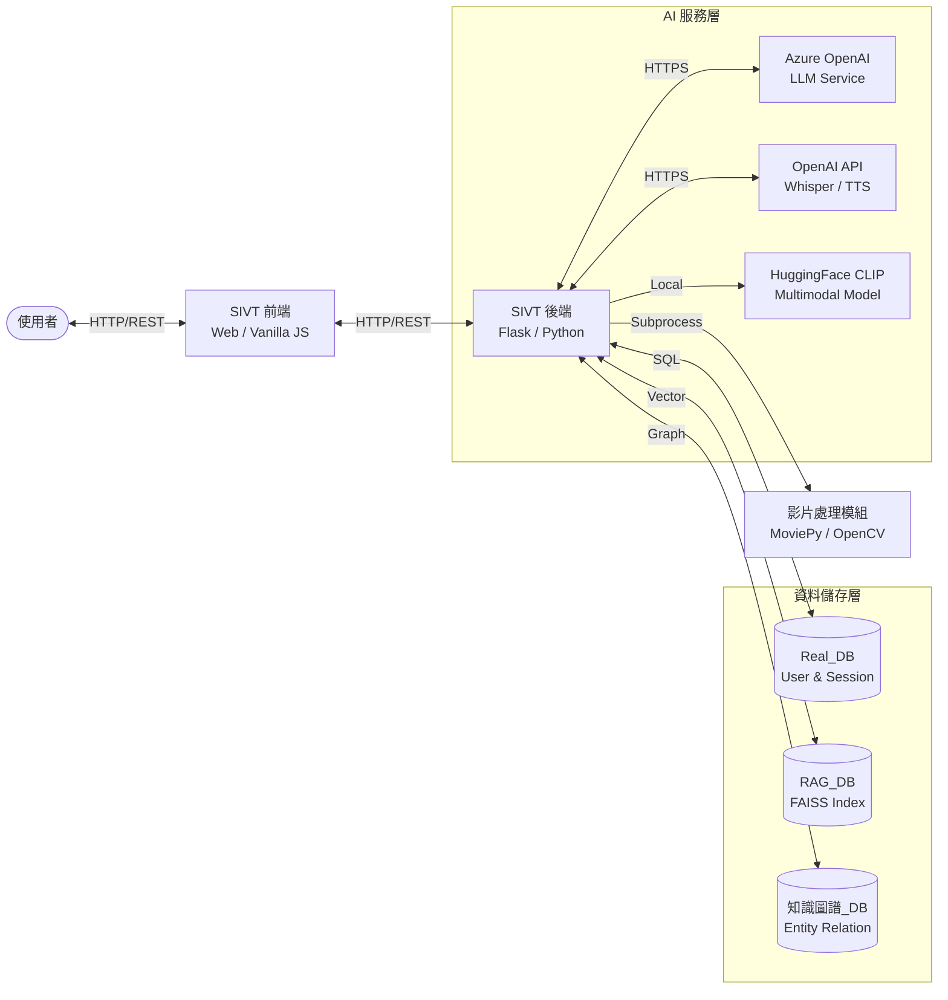
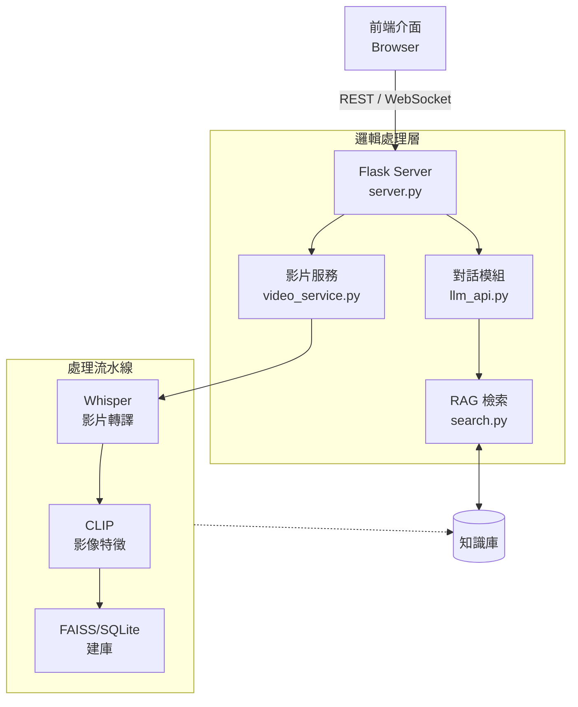
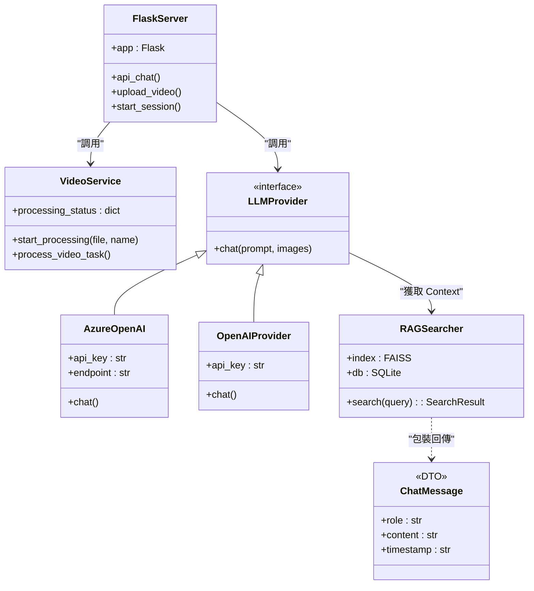
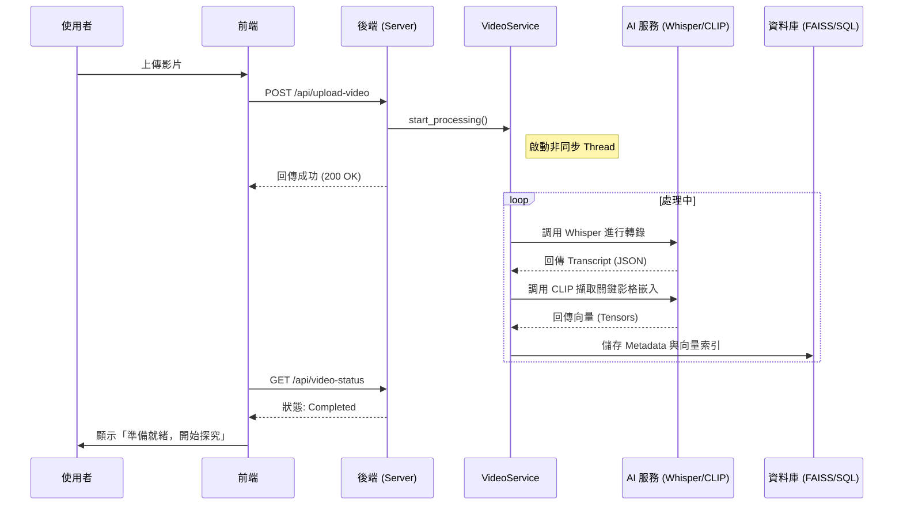
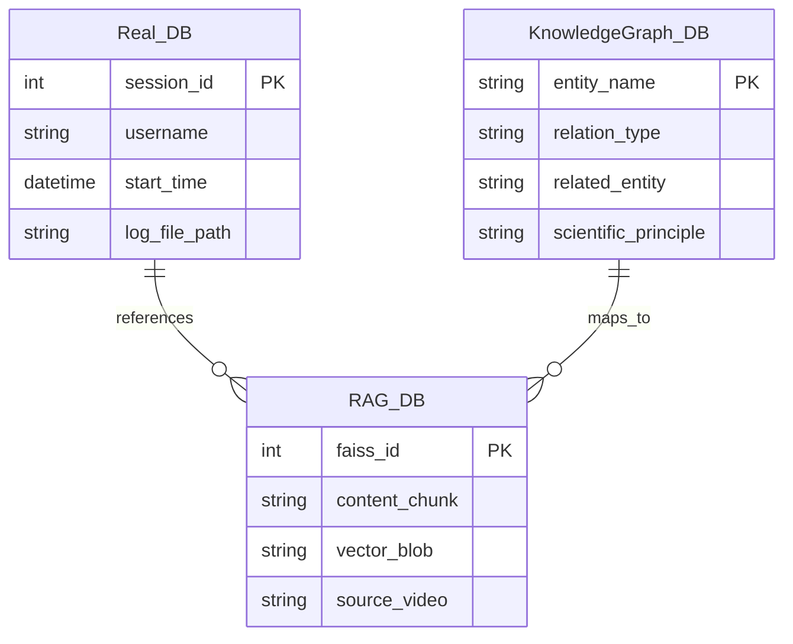
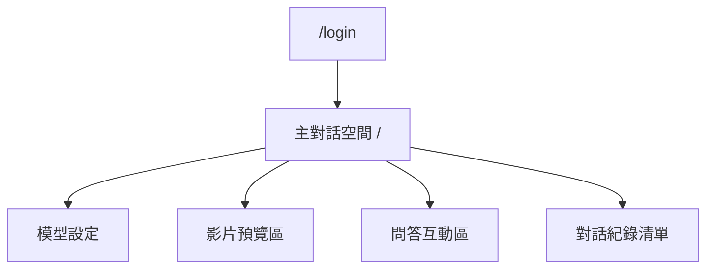
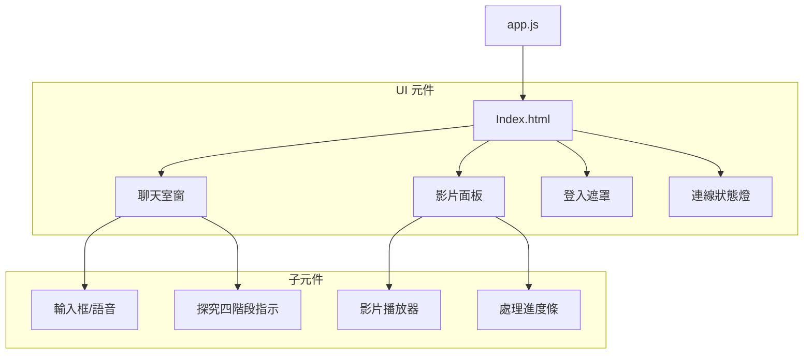
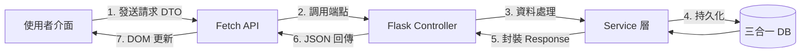
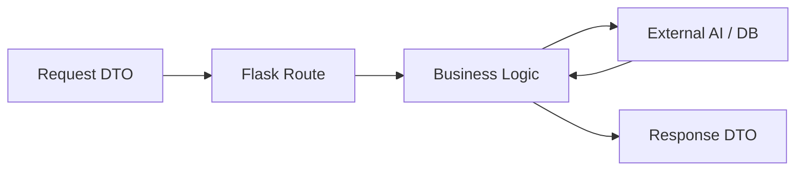

# SIVT 科學探究虛擬教師

## 摘要
SIVT 是一個結合大語言模型 (LLM) 與多模態檢索增強生成 (RAG) 技術的虛擬教師系統。本系統旨在解決影片教學中互動性不足的問題，透過自動化的影片處理流程（語音轉寫、關鍵畫面擷取、向量索引），建構出一個具備學科背景知識的 AI 助教。使用者可以透過對話介面與影片內容進行深度互動，實現個人化的科學探究學習體驗。

### 核心技術棧
- **前端**: Vanilla JS, HTML5, CSS3 (Flexbox/Grid), Web APIs (MediaRecorder, Fetch).
- **後端**: Python 3.9+, Flask, Flask-CORS.
- **AI/ML**: OpenAI GPT-4o, Azure OpenAI, Whisper (Speech-to-Text), CLIP (Multimodal Embedding).
- **資料儲存**: SQLite (Metadata), FAISS (Vector Store).

### 系統全景圖


---

## 1. 系統需求

| 類別 | 最低需求 | 建議需求 | 用途 |
| :--- | :--- | :--- | :--- |
| **OS** | Windows 10 / Ubuntu 20.04 | Windows 11 / Ubuntu 22.04 | 執行環境 |
| **CPU** | 4 Cores | 8 Cores+ | 影片處理與模型運算 |
| **RAM** | 8 GB | 16 GB+ | CLIP 模型加載與 FAISS 檢索 |
| **Runtime** | Python 3.9 | Python 3.10+ | 後端邏輯處理 |
| **Database** | SQLite 3 | SQLite 3 | 中繼資料儲存 |
| **Vector Index** | FAISS | FAISS | 向量相似度檢索 |
| **GPU** | N/A (CPU-only support) | NVIDIA GPU (8GB VRAM) | 加速轉錄與影像嵌入 |

---

## 2. 快速開始

### A) 本機啟動 (開發環境)

1. **環境準備**
   ```bash
   # 複製專案
   git clone <project-url>
   cd SIVT
   
   # 建立虛擬環境 (建議)
   python -m venv venv
   source venv/Scripts/activate  # Windows
   
   # 安裝依賴
   pip install -r SIVT-Backend/requirements.txt
   ```

2. **配置金鑰**
   在 `SIVT-Backend/` 下建立 `api_key.json`:
   ```json
   {
       "openai": {
           "api_key": "YOUR_OPENAI_KEY",
           "model": "gpt-4o-mini"
       },
       "azure": {
           "api_key": "YOUR_AZURE_KEY",
           "endpoint": "YOUR_ENDPOINT"
       }
   }
   ```

3. **啟動後端**
   ```bash
   cd SIVT-Backend
   python server.py
   ```

4. **訪問前端**
   直接啟動後端後，訪問 `http://localhost:5000` 即可看到整合後的介面。

### B) 驗證方式
- **健康檢查**: `GET http://localhost:5000/api/health` -> 應回傳 `{"status": "ok"}`。
- **介面確認**: 前端右上角狀態燈應顯示為「已連線 (綠色)」。

---

## 3. 專案目錄與模組地圖

### 3.1 專案目錄樹
```bash
SIVT/
├── SIVT-Backend/          # 後端 Flask 主程式
│   ├── chat_logs/         # 使用者對話紀錄 (CSV)
│   ├── RAG/               # 整合搜尋模組
│   ├── video_process/     # 影片預處理流水線
│   ├── server.py          # API 入口點
│   ├── llm_api.py         # LLM 供應商串接
│   └── video_service.py   # 影片處理服務管理
├── SIVT-Frontend/         # 前端靜態資源
│   ├── index.html         # 主介面
│   ├── app.js             # 前端邏輯核心
│   └── styles.css         # UI 樣式定義
└── RAG_Anything_build_by_GK/ # 獨立 RAG 工具組
```

### 3.2 模組互動總覽


---

## 4. 後端設計

### 4.1 分層架構說明
- **Controller (Flask Routes)**: 負責處理 HTTP 請求、參數驗證與 Session 管理。
- **Service Layer**: 
    - `video_service`: 管理影片處理的非同步線程。
    - `llm_api`: 抽象化不同 LLM 供應商 (Azure/OpenAI) 的呼叫邏輯。
- **Data Access**: 透過 `sqlite3` 與 `faiss` 進行資料讀寫。

### 4.2 UML 類別圖


### 4.3 主要流程序列圖 (影片處理)


---

## 5. 資料庫設計

### 5.1 核心三庫架構 (ERD)
本系統採用「關聯、向量、圖形」三合一資料庫儲存策略，以支援複雜的科學探究教學：



### 5.2 資料生命週期與用途
1. **Real_DB (關聯式)**: 
   - **工具**: SQLite / CSV。
   - **用途**: 管理使用者 Session、儲存對話評分 (Rating) 與稽核日誌 (Audit Logs)。
2. **RAG_DB (向量式)**: 
   - **工具**: FAISS。
   - **用途**: 儲存影片逐字稿與關鍵畫面的 CLIP 嵌入向量，支援語意搜尋。
3. **知識圖譜_DB (圖形化)**: 
   - **工具**: 抽象化節點結構。
   - **用途**: 定義學科知識點 (Entity) 之間的邏輯關係（如：光折射 -> 凸透鏡 -> 成像原理），輔助 AI 生成更具結構性的引導問題。

---

## 6. 前端設計

### 6.1 Sitemap / 路由圖


### 6.2 UI 元件架構圖


### 6.3 前端狀態與資料流詳解

#### A) 請求與回應資料對照表
| 前端功能 | 需要資料 (Requirement) | 後端回傳 (Response) | 狀態變更 |
| :--- | :--- | :--- | :--- |
| **開始探究 (Login)** | `username` | `session_id`, `start_time` | 切換至主介面，開啟 Session 監聽 |
| **上傳影片** | `video` (File Object) | `message` (處理開始確認) | 開啟側邊影片面板，啟動 pollInterval |
| **狀態輪詢** | `None` | `current_stage`, `is_processing`, `error` | 更新進度條樣式 (`active`/`completed`) |
| **發送問答** | `message`, `session_id`, `provider` | `response` (Markdown), `phase`, `rag_images` | 渲染訊息氣泡，更新探究四階段燈號 |
| **語音轉文字** | `audio` (WebM Blob) | `text` (識別內容) | 將翻譯結果填入輸入框 `messageInput` |

#### B) 資料流向圖


---

## 7. API 規格

| Method | Path | Auth | 用途 | Request DTO | Response DTO |
| :--- | :--- | :--- | :--- | :--- | :--- |
| POST | `/api/session/start` | No | 建立新對話 | `{"username": "str"}` | `{"session_id": "...", "success": true}` |
| POST | `/api/chat` | Session ID | 文字詢問 | `{"message": "str", "session_id": "..."}` | `{"response": "str", "rag_images": []}` |
| POST | `/api/upload-video` | No | 處理影片 | `FormData(video)` | `{"message": "處理中", "success": true}` |
| GET | `/api/health` | No | 健康檢查 | N/A | `{"status": "ok"}` |

### API 資料流總覽


---

## 8. 安全性與權限
- **Session 模式**: 透過手動輸入使用者名稱建立 UUID Session。
- **資料隔離**: 對話紀錄依據 `username` 與 `session_id` 分別存成 CSV 檔案。
- **CORS**: 啟用 `flask_cors` 允許開發環境跨域。

## 9. 測試策略與品質
- **單元測試**: TODO: 待補 (規劃中：API Endpoint Mocking 測試)。
- **手動測試**: 
    1. 驗證影片處理流水線能否正確產生 `.index` 檔案。
    2. 驗證語音辨識 (Whisper) 與語音合成 (TTS) 功能。

## 10. 監控與維運
- **日誌**: 控制台即時輸出 `[Session]`, `[RAG]`, `[VideoService]` 日誌。
- **故障排除**: 
    - 若 RAG 搜尋失敗，請檢查 `SIVT-Backend/video_process/output/rag_mm.db` 是否存在且非空。
    - 若 API 報錯 400，請先執行 `/api/session/start`。
